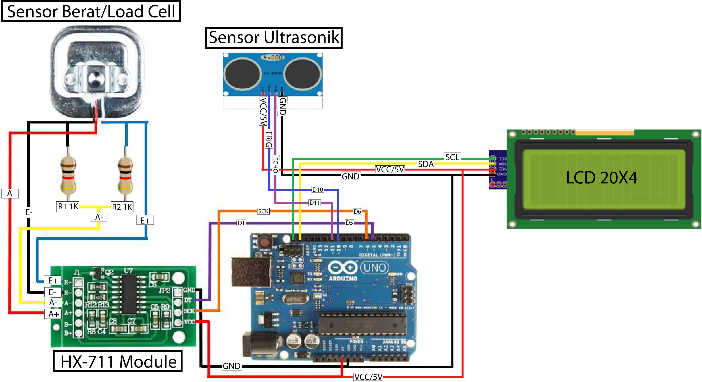

# BMI Monitoring Project

Proyek ini berisi dua versi program Arduino untuk menghitung **Body Mass Index (BMI)** dan menampilkan hasilnya pada LCD.

## Versi 1: `bmi_v2.ino`
- Input menggunakan **sensor berat** dan **sensor tinggi**.
- Hasil BMI ditampilkan di LCD I2C.

## Versi 2: `bmi_v2_bmi_potensio.ino`
- Input menggunakan **potensiometer** untuk simulasi tinggi/berat.
- Cocok untuk demonstrasi / simulasi tanpa sensor nyata.

## Rumus BMI
BMI dihitung dengan rumus berikut:

```
BMI = Berat Badan (kg) / (Tinggi Badan (m) * Tinggi Badan (m))
```

## Kategori BMI
- **< 18.5** → Berat badan kurang
- **18.5 – 24.9** → Normal
- **25 – 29.9** → Kelebihan berat badan
- **≥ 30** → Obesitas

## Screenshot
Hasil simulasi ditampilkan pada LCD seperti contoh berikut:



---
## English Version

This project contains two Arduino sketches to calculate **Body Mass Index (BMI)** and display the result on an LCD.

### Version 1: `bmi_v2.ino`
- Input from **weight sensor** and **height sensor**.
- Output shown on I2C LCD.

### Version 2: `bmi_v2_bmi_potensio.ino`
- Input from **potentiometer** to simulate weight/height.
- Suitable for demo/testing without real sensors.

### BMI Formula
```
BMI = Weight (kg) / (Height (m) * Height (m))
```

### BMI Categories
- **< 18.5** → Underweight
- **18.5 – 24.9** → Normal
- **25 – 29.9** → Overweight
- **≥ 30** → Obesity

### Screenshot
Simulation results shown on LCD:


